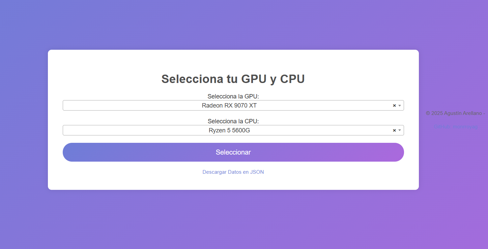
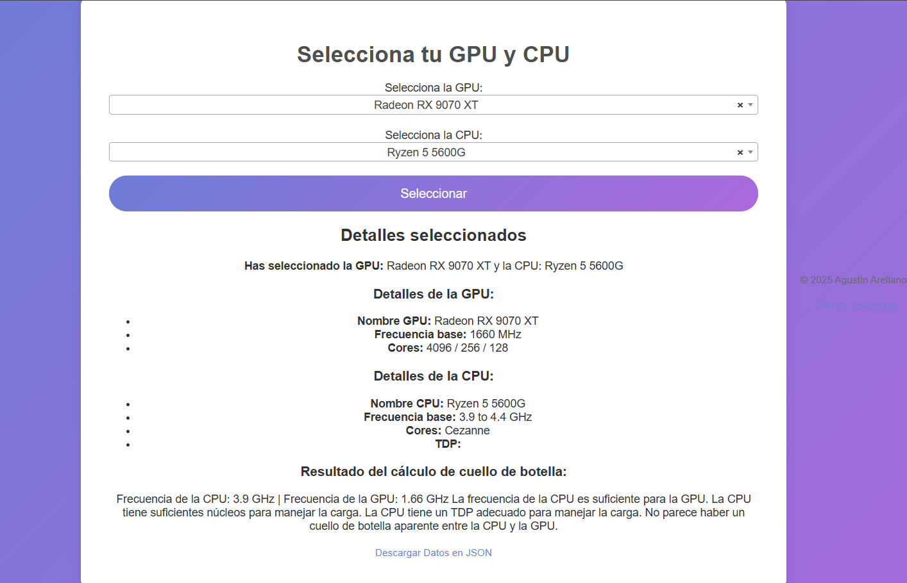

# Calculadora de Cuello de Botella - PC




## Descripción

Este proyecto tiene dos funcionalidades principales:

1. **Web Scraping para obtener información de hardware**: Utiliza scraping web para extraer información detallada sobre las GPU y CPU disponibles en línea desde diversas fuentes. Este proceso permite obtener una base de datos actualizada con especificaciones como la frecuencia base, núcleos, TDP, y otros parámetros clave para comparar el rendimiento de la CPU y la GPU.

2. **Calculadora de Cuello de Botella**: Una vez obtenida la información de la CPU y la GPU seleccionadas, el sistema calcula si existe un cuello de botella entre ellas. La calculadora compara factores como la frecuencia de la CPU y la GPU, el número de núcleos, el TDP, y el consumo de energía para determinar si alguno de estos factores está limitando el rendimiento del otro.

---

## Funcionalidades

### 1. Web Scraping para Obtener Información de Hardware

El componente de **Web Scraping** utiliza bibliotecas de Python como `requests` y `BeautifulSoup` para extraer información detallada de las GPUs y CPUs desde sitios web de confianza. Este proceso no requiere APIs costosas y permite acceder a datos relevantes sobre las especificaciones de hardware.

- **Objetivo**: Extraer datos de **GPU** y **CPU** (nombre, frecuencia, núcleos, TDP, etc.) para alimentar la calculadora y permitir a los usuarios obtener detalles actualizados.
- **Fuente de Datos**: Se extrae información de sitios web especializados en hardware, como [TechPowerUp](https://www.techpowerup.com/).
- **Proceso**: El script realiza solicitudes a páginas web específicas, las parsea y extrae los detalles, que luego se almacenan en un archivo JSON que se utiliza en el front-end de la aplicación.

### 2. Calculadora de Cuello de Botella entre CPU y GPU

Una vez que se tiene la información de la CPU y la GPU seleccionada, la calculadora realiza un análisis detallado para determinar si existe un **cuello de botella** entre ambos componentes. Este cálculo se basa en:

- **Frecuencia Base**: La frecuencia de la CPU y la GPU se comparan para verificar si la CPU está limitando el rendimiento de la GPU.
- **Núcleos**: Se compara la cantidad de núcleos de la CPU con la cantidad de núcleos de la GPU para asegurar que la CPU tenga suficiente poder de procesamiento para manejar las demandas de la GPU.
- **TDP (Thermal Design Power)**: El TDP de la CPU se compara con el de la GPU para verificar que la CPU no esté limitada en cuanto a capacidad de energía, lo que podría afectar el rendimiento.

Este análisis genera un mensaje que proporciona recomendaciones y determina si la CPU podría estar limitando el rendimiento de la GPU.

---

## Instalación

### Paso 1: Clonar el Repositorio

Primero, clona este repositorio en tu máquina local utilizando el siguiente comando:

```bash
git clone https://github.com/monrroyag/calculadorac-cuello-de-botella-pc.git
```

### Paso 2: Instalar las Dependencias

Asegúrate de tener Python instalado en tu máquina y, a continuación, instala las dependencias necesarias:

```bash
cd calculadorac-cuello-de-botella-pc
pip install -r requirements.txt
```

### Paso 3: Ejecutar la Aplicación Flask

Para ejecutar la aplicación, usa el siguiente comando:

```bash
python app.py
```

Esto iniciará el servidor web Flask en tu máquina local. Abre tu navegador y ve a la siguiente URL:

```
http://127.0.0.1:5000/
```

---

## Cómo Funciona el Código

### Web Scraping

El **web scraping** se maneja en el backend de la aplicación, específicamente en el archivo `app.py`. La función principal que maneja este proceso es `load_json_data()`, que carga los datos de los componentes de hardware (GPU y CPU) desde un archivo `hardware_data.json`.

El código utiliza `requests` para hacer peticiones HTTP a las páginas de hardware y luego `BeautifulSoup` para analizar el contenido HTML y extraer la información relevante. Esta información se estructura y se guarda en el archivo `hardware_data.json`, que es utilizado por la aplicación para mostrar los datos en la interfaz de usuario.

### Flujo de la Calculadora de Cuello de Botella

1. **Selección de GPU y CPU**: En la interfaz de usuario (`index.html`), el usuario selecciona una GPU y una CPU desde listas desplegables. Los datos de las opciones provienen de la información almacenada en el archivo JSON.

2. **Análisis de Cuello de Botella**: Cuando el usuario hace clic en el botón "Seleccionar", el servidor Flask recibe la información de la GPU y la CPU seleccionadas a través de un formulario `POST`. La función `calculate_bottleneck()` realiza los cálculos basados en la frecuencia de la CPU, la frecuencia de la GPU, los núcleos y el TDP de ambos componentes.

3. **Resultados**: Los resultados del cálculo son presentados en la misma página. La aplicación genera un mensaje detallado que muestra si existe un cuello de botella en el sistema. Esto incluye comparaciones sobre la frecuencia de la CPU y la GPU, la cantidad de núcleos y el TDP.

4. **Descarga de Datos**: El usuario tiene la opción de descargar los datos en formato JSON mediante el enlace "Descargar Datos en JSON".

### Archivos Clave

- `app.py`: El código principal de Flask que maneja las rutas y lógica de la aplicación.
- `hardware_data.json`: El archivo JSON donde se almacenan los datos extraídos de las GPUs y CPUs mediante web scraping.
- `requirements.txt`: El archivo con las dependencias de Python necesarias para que la aplicación funcione correctamente.
- `index.html`: El frontend de la aplicación que utiliza Jinja2 para integrar los datos de la GPU y la CPU con el HTML.
- `style.css`: El archivo de estilo que define la apariencia de la página web.

---

## Tecnologías Utilizadas

- **Flask**: Framework web ligero para Python, utilizado para construir la aplicación.
- **Jinja2**: Motor de plantillas de Python utilizado para renderizar dinámicamente los datos en el HTML.
- **BeautifulSoup**: Biblioteca para realizar web scraping y extraer datos de páginas HTML.
- **Requests**: Biblioteca para realizar solicitudes HTTP y obtener los datos de páginas web.
- **CSS**: Estilos personalizados para la interfaz de usuario, con un diseño responsivo.
- **Select2**: Biblioteca de JavaScript para mejorar la experiencia de las listas desplegables.

---

## Contribuciones

Las contribuciones son bienvenidas. Si deseas mejorar el proyecto, por favor abre un "issue" o crea un "pull request".

---

## Licencia

Este proyecto está bajo la licencia MIT.

---

© 2025 Agustín Arellano - [GitHub: monrroyag](https://github.com/monrroyag)

---

### Explicación de las Imágenes:

Las imágenes que se han incluido en el `README.md` muestran la interfaz de usuario de la aplicación para que los usuarios puedan ver cómo se ve la aplicación cuando interactúan con ella. Estas imágenes sirven como referencia visual para entender el flujo y las interacciones de la aplicación.
